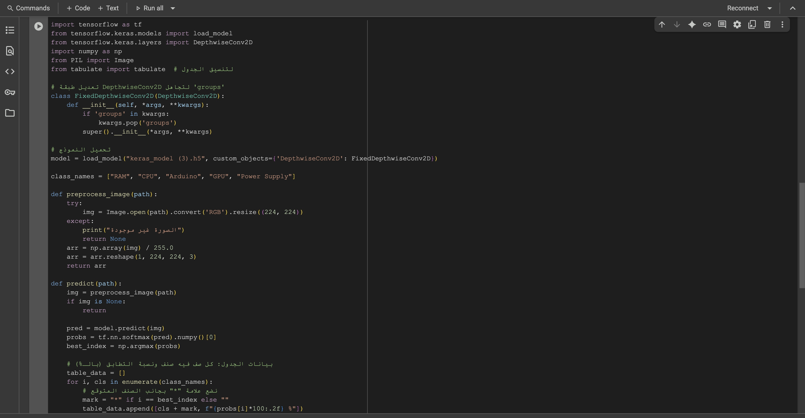
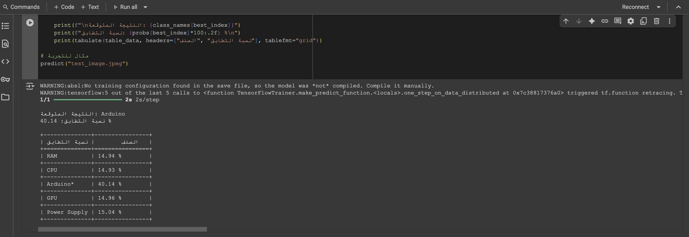

## 1. Project Description
This project involves developing a machine learning model to classify various computer hardware components using images. The classification task includes identifying devices such as:
- CPUs  
- GPUs  
- RAM modules  
- Arduino boards  
- Power supplies  

The model was trained using Google's **Teachable Machine** platform and exported in a format compatible with **TensorFlow/Keras**. Testing and validation were performed in **Google Colab**.

---

## 2. Tools & Technologies Used
- **Google Teachable Machine** – for model training  
- **Google Colab** – for testing and experimentation  
- **Keras / TensorFlow** – backend for the trained model  
- **Python** – for scripting and running the classification  
- **PIL (Pillow)** – for image loading and resizing  
- **NumPy** – for handling image arrays and predictions  
- **Matplotlib** – (optional) for visual display of results  

---

## 3. What is Teachable Machine?
[Teachable Machine](https://teachablemachine.withgoogle.com/) is a user-friendly web-based tool created by Google that allows users to train machine learning models without needing programming knowledge. Users can upload datasets (image/audio/pose), label them, and train classification models through an intuitive interface.

For this project, the **Image Project** feature of Teachable Machine was used to classify hardware images. The trained model was then exported as a `.h5` file for use in Python.

---

## 4. Testing the Model in Google Colab

The model was tested using a Python notebook in **Google Colab**. The testing process included the following steps:

###  Model Upload
- The file `keras_model.h5` (the trained model) was uploaded to Colab.
- The label mapping file `labels.txt` was also uploaded.

### Image Preprocessing
- Images were loaded using **PIL**, resized to the model’s expected input size (e.g., 224x224).
- Converted to NumPy arrays, normalized, and passed into the model for prediction.

### Prediction Mapping
Predictions were mapped using the label index file `labels.txt` as follows:
0 RAM
1 CPU
2 Arduino
3 GPU
4 Power Supply

### Output Evaluation
- The model returned probability scores for each class.
- The class with the highest probability was selected as the final prediction.

---

## 5. Files Uploaded to Google Colab

The following files were utilized during testing:

- `keras_model.h5` – the trained neural network model  
- `labels.txt` – text file containing label indices and class names  
- `test_images/` – directory containing example images for evaluation (uploaded manually)

---

## 6. Sample Output Images

Below are some output examples of model predictions on test images:

### 🖼️ Example 1: GPU  

### 🖼️ Example 2: Arduino  

### 🖼️ Example 3: Power Supply  

---

## 7. Challenges Faced

- **Image Quality Sensitivity**: Prediction accuracy varied depending on lighting and background conditions.  
- **Input Shape Mismatch**: The input image had to be resized to 224x224 pixels to match the model’s expected input shape.  
- **Colab File Persistence**: Uploaded files are not saved between sessions unless mounted via Google Drive.  
- **Label Matching**: Ensuring label indexes aligned correctly with class names.  

---

## 8. Future Improvements

- Expand dataset with more varied images to improve model robustness.  
- Integrate Google Drive for persistent storage in Colab.  
- Deploy the model using a web interface with TensorFlow.js.  
- Add confidence thresholding and error logging during prediction.  

---

## 9. Sample Inference Code in Colab

Here is an example code snippet used in Colab to test the uploaded model on a test image:

